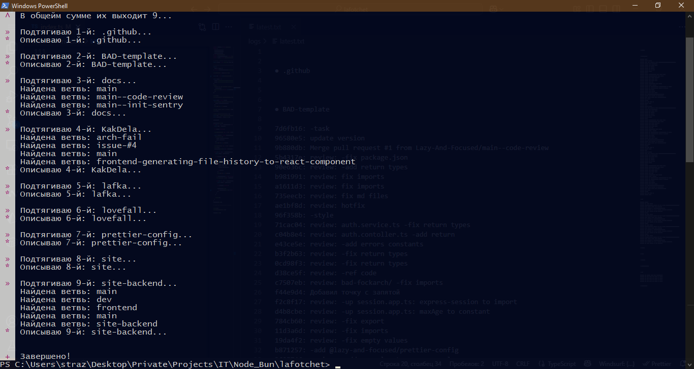

# lafotchet



## Настройка

### 1. Установка зависимостей

```bash
bun install
```

### 2. Создание `.env` окружения

```properties
GITHUB_ACCESS_TOKEN=сюда_токен_вставляй_да
# По умолчанию будет использовать "Lazy-And-Focused"
#FETCHED_REPO_OWNER=
```

Также можете заглянуть в [`./src/constants/index.ts`](./src/constants/index.ts):

### 3. Запуск скрипта

```bash
bun run start
```

## Техническая информация

Проект был создан через `bun init` на [Bun](https://bun.com) v1.2.20.
Используется [Octokit](https://github.com/octokit/octokit.js) и мой
пьяный код.
